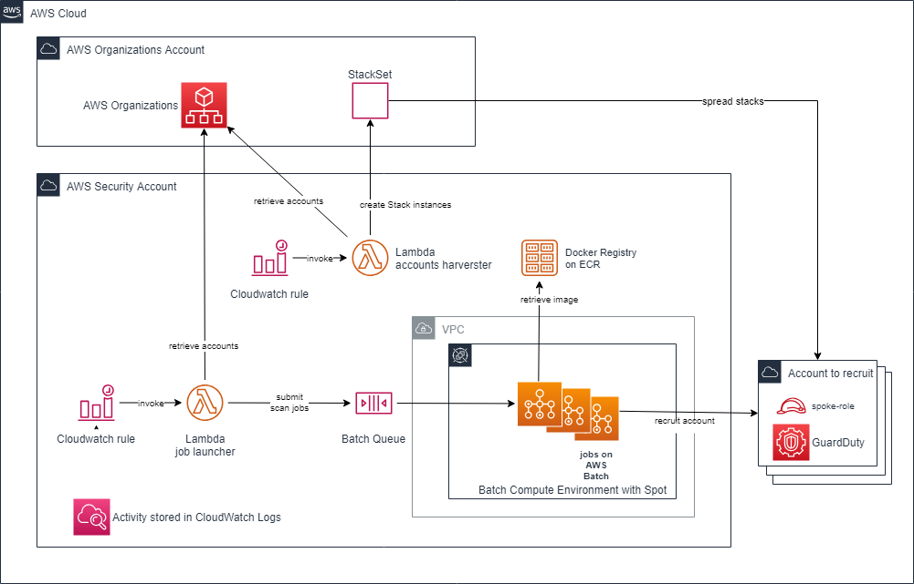

# GuardDuty Recruiter

**Note : AWS released on Apr 21, 2020 an interesting improvement on [GuardDuty to support AWS Organizations support](https://aws.amazon.com/about-aws/whats-new/2020/04/amazon-guardduty-simplifies-multi-account-threat-detection-with-support-for-aws-organizations). It is now possible to automaticaly apply new accounts as GuardDuty members. Please read [Managing GuardDuty accounts with AWS Organizations](https://docs.aws.amazon.com/guardduty/latest/ug/guardduty_organizations.html). This new out-of-the-box feature makes this repository useless. Please note that GuardDuty is still a regional service, it needs to be activated on all used regions.**

## Introduction

[Amazon GuardDuty](https://aws.amazon.com/guardduty) is a great service which provides threat detection looking for suspicious activity on network flows (VPC and DNS) and CloudTrail messages. Activating the service a done thanks to a one-click option.
GuardDuty works on a per account and per region basis, but a security account can run as master, gathering all findings in the same region.
Unfortunately, the master cannot automatically activate and invite members at-scale, which generates additional run activity and could create issues for companies working with large numbers of accounts and numbers of different AWS regions.
That is where GuardDuty Recruiter comes from ...

## Description

GuardDuty Recruiter's job is to ensure that :
- GuardDuty is activated on all accounts and all regions of a same Organization,
- all accounts of a same region are invited by the master account to centralize findings.
It runs periodically (to ensure either on-boarding and auto-remediation) with the highest level of autonomy.

## Design

### Diagram

### Content

GuardDuty Recruiter runs [amazon-guardduty-multiaccount-scripts](https://github.com/aws-samples/amazon-guardduty-multiaccount-scripts) into AWS Batch jobs.
It industrializes the invitations of members thanks to the following AWS resources :
- CloudWatch Rule to trigger the Lambda executions
- Batch to embed the [enableguardduty.py](https://github.com/aws-samples/amazon-guardduty-multiaccount-scripts/blob/master/enableguardduty.py) business logic with a Container and run asynchronously.
- ECR to host the Docker image that embeds enableguardduty.py
- Lambda to gather the accounts to invite and submit the jobs
- CloudWatch Logs to log the global activity

### Explanation

The system works around two independent Lambdas :
- guarddutyrecruiter-job-launcher : retrieves all the accounts from AWS Organizations and submit as many AWS Batch jobs as there are accounts.  This Lambda is invoked by a CloudWatch rule but could be invoked manually.
- guarddutyrecruiter-account-harverster : it is in charge of updating the StackSet that spread on all accounts the role used by Batch jobs to invite new GuardDuty members. This Lambda is invoked by a CloudWatch rule but could be invoked manually.

## Prerequisites

GuardDuty Recruiter needs :
- an AWS account running AWS Organizations
- an AWS account running as a security account to be the GuardDuty master
- a VPC with at least a subnet capable to join AWS APIs (through NAT Gateway)

## Installation

1. deploy the [cf-guarddutyrecruiter-common.yml](cf-guarddutyrecruiter-common.yml) CloudFormation stack in the security account
2. Build, tag and push the Docker image. Follow the information provided in the ECR repository page.
3. deploy the [cf-guarddutyrecruiter-org-account.yml](cf-guarddutyrecruiter-org-account.yml) in the account using AWS Organizations.
4. deploy the [cf-guarddutyrecruiter-spoke-account.yml](cf-guarddutyrecruiter-spoke-account.yml) in all the spoke accounts to scan. To make it easy, use StackSets Stacks from the AWS Organizations level.
5. deploy the [cf-guarddutyrecruiter-batch.yml](cf-guarddutyrecruiter-batch.yml) CloudFormation stack in the security account

Do not forget two different strong ExternalIds like UUID (one for Organizations role, one for spoke role)

## How to use it

Invitations are performed on a configured daily basis and reports are stored in the CloudWatch.
New accounts or regions are daily discovered and automatically invited

## Notes
It has been considered to move the Python script into a Lambda instead of into a Batch Container.
This possibility has not been adopted yet to use and keep [enableguardduty.py](https://github.com/aws-samples/amazon-guardduty-multiaccount-scripts/blob/master/enableguardduty.py) as it is.
But, either because the execution time matches with the Lambda timeout duration and for cost optimizations ... this alternative is more than studied ... to be continued ...
